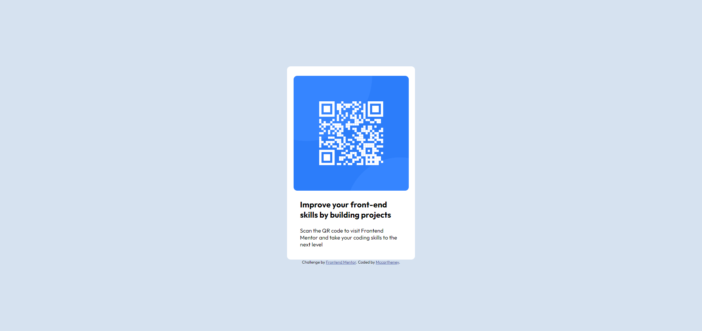

## Table of contents

- [Overview](#overview)
  - [Screenshot](#screenshot)
  - [Links](#links)
- [My process](#my-process)
  - [Built with](#built-with)
- [Author](#author)

## Overview

### Screenshot

### Links

- Solution URL: [Solution URL](https://github.com/mccartheney/QR-code-component)
- Live Site URL: [Live site URL](https://strong-quokka-bce087.netlify.app/)

## My process

### Built with

- HTML5
- CSS
- Flexbox

## Author

- GitHub - [@mccartheney](https://github.com/mccartheney)
- LinkedIn - [@Mccartheney honofre](https://www.linkedin.com/in/mccartheney-honofre-892709292/)